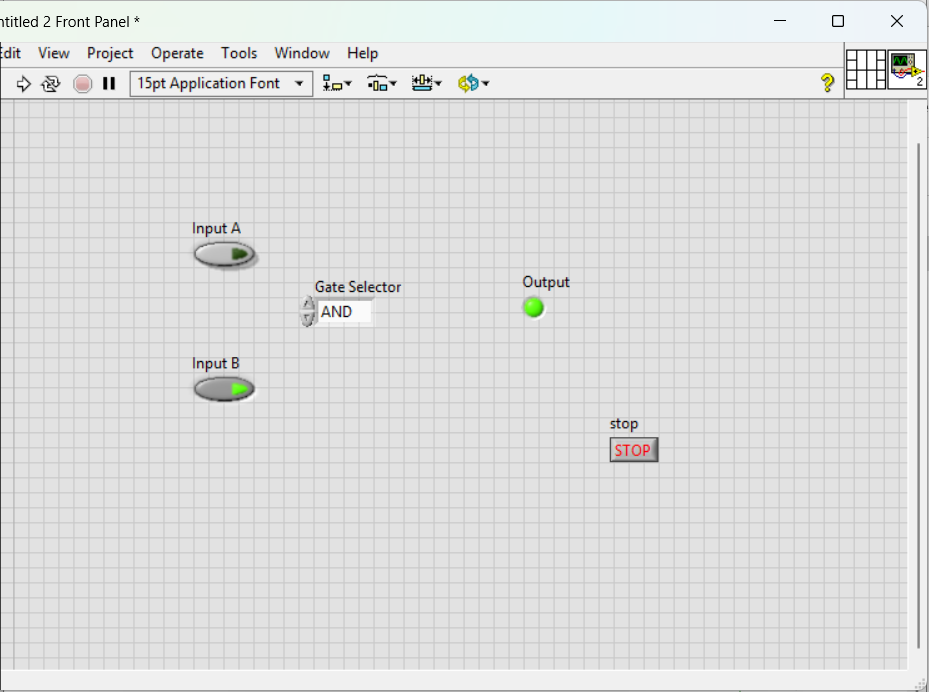

# LabVIEW Digital Logic Gate Simulator

This project is a basic **Digital Logic Gate Simulator** built using **LabVIEW**. It allows users to interactively explore the behavior of fundamental logic gates like AND, OR, NOT, NAND, NOR, XOR, and XNOR.

---

## Features

- Enum-based gate selector (AND, OR, NOT, etc.)
- Toggle switches for inputs A and B
- Real-time logic output using an LED indicator
- Supports all standard digital logic gates
- Clean and user-friendly GUI

---

## Applications

- Educational demonstration for students learning digital logic
- Quick logic simulation for lab exercises or teaching purposes
- Visual testing of logic gate behavior without physical hardware

---

## Screenshots

### Front Panel  

### Block Diagram  

---

## Demo

A working video demonstration is available.

- Open `tutorial.mp4` included in this repository

---

## Live Website

The project is hosted using GitHub Pages:  
[https://sindhukhandayrao.github.io/labview-logic-simulator/](https://sindhukhandayrao.github.io/labview-logic-simulator/)

---

## File Structure
index.html # Main web page
frontpanel.png # LabVIEW front panel screenshot
blockdia.png # Block diagram screenshot
tutorial.mp4 # Demo video 
README.md # Project documentation

---

## Built With

- [LabVIEW](https://www.ni.com/en-us/shop/labview.html)
- [GitHub Pages](https://pages.github.com/)

---

## Author

**Sindhu Khandayrao**  
Electronics & Communication Engineering  
BVRIT-Narsapur

